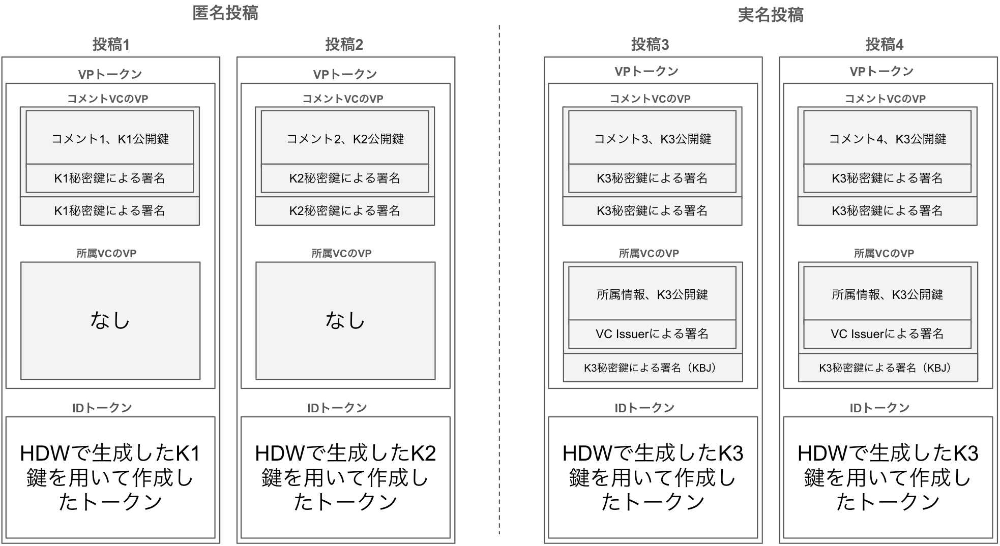

# Bunsin-Wallet-iOS

[OWND Wallet](https://github.com/OWND-Project/OWND-Wallet-iOS) をベースにし、 DataSign Inc. が開発するデジタルアイデンティティウォレット(DIW)です。
ビルドされたアプリケーションは、 App Storeにて [Bunsin Wallet](https://apps.apple.com/jp/app/bunsin-wallet/id6739558008) として公開しています。
アプリケーションの透明性を確保する目的で、ソースコードを本リポジトリにて公開します。

## OWND Wallet・Boolcheckとの関係

 [Boolcheck](https://app.boolcheck.com/) は、総務省の [インターネット上の偽・誤情報対策技術の開発・実証事業](https://www.soumu.go.jp/main_sosiki/joho_tsusin/d_syohi/taisakugijutsu.html) の中で
DataSignが開発した偽・誤情報対策のための真偽表明プラットフォームです。Bunsin Walletを使用することで、本プラットフォームに情報を投稿することが可能です。

Boolcheckへの投稿を実現するための機能を、OWND Wallet（DIWとしての一般的な機能を備える）に追加したものがBunsin Walletです。
なお、Boolcheckと連携しない、一般的なDIWのユースケースでも使用できることを目指しています。

### Boolcheck向けに追加された機能の概要

Boolcheck側は、以下の3つの情報を受け取るVerifierとして動作します。1,2の情報提供については、Bunsin Walletを用いずとも一般的なDIWでも実現されるものです。
3の情報をVerifier(Boolcheck)の要求に応じて、オンデマンドにウォレット内部で生成し提示する機能が新たに追加されています。

- 1. SIOPv2によるIDトークン
- 2. 所属VCのプレゼンテーション(SD-JWT形式)
- 3. コメントVCのプレゼンテーション(JWT_VC_JSON形式)

3のVCは、Boolcheckに投稿するメインのコンテンツであり、偽誤情報に対する表明を表します。このデータは、2のVCに紐づく鍵で署名されています。
なお2の情報について、Boolcheckへの提供はオプションでです。提供しない場合、これを匿名投稿といいます。この場合は、3の情報は無作為に生成した鍵により署名されます。

### Boolcheckへ送信する情報と鍵の関係性

Boolcheckへ送信する上述の3つの情報と、その生成に用いるウォレット内部で管理される鍵の関係は以下に図示する通りです。

